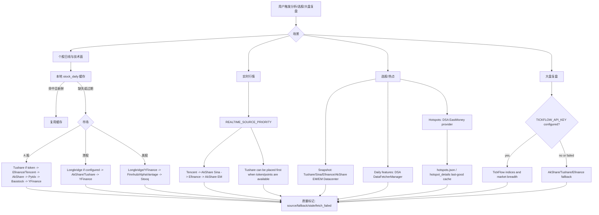
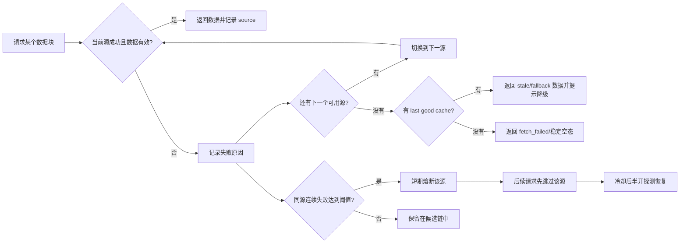
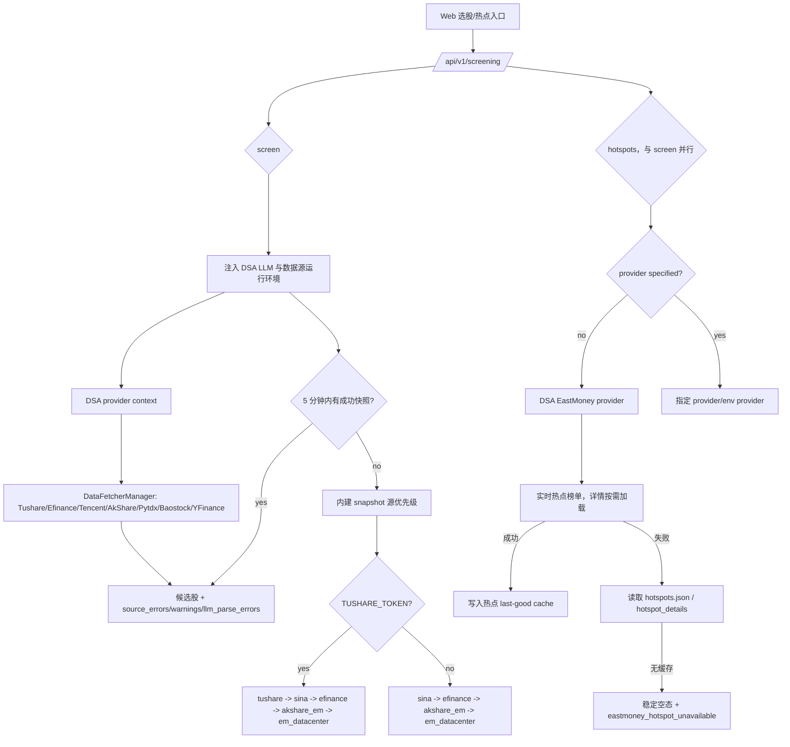

# 数据源稳定性与故障处理图示

本文面向用户、部署者和维护者，说明 DSA 已接入的数据源如何参与分析、选股和大盘复盘，以及当数据源失败时系统会怎么降级。

核心原则：先用项目已经接入并验证过的数据源，把失败路径讲清楚；新增外部数据源应放在第二阶段，避免先扩大维护面。

### 云端零代理真实日线诊断（尚未授权执行）

本地准备了一个独立、公开仓库**仅人工选择**的 `Network Smoke` 模式 `cn-daily-readonly-probe`。该模式复用现有 `TencentFetcher`、`daily_data_identity` 和交易所最新已完成交易日历，只读取一只 `600519` 的最近有界历史日线，不运行主分析、不写 SQLite/Report/Ledger、不发通知、不运行模型、不接 Secrets/Environment、不上传含行情的附件，且依赖安装与行情查询两个实际网络消费者均先清除 HTTP(S)/SOCKS 代理变量，禁止项目控制的云端代理配置。历史私有仓库原有定时 smoke Job 和非阻断 smoke 合同保持不变。

真实云端运行前另需代码与 workflow 发布审核、人工 dispatch 及依赖安装/网络费用边界的明确准入。**本地模拟 PASS 绝不等于云端取得最新真实 OHLCV。** 输出只含运行时已完成交易日、返回覆盖范围、标准化内容 SHA、来源响应支路/复权与单位身份；`OBSERVED_LATEST_DAILY_READONLY` 也只证明此次数值/时点诊断，数据持久化、版权/使用权、历史修订身份、PIT、完整研究、Email 和训练依旧未准入。腾讯返回非 `qfqday`、缺数据、缺/伪造源身份、行情旧于最新完成日、未来观察时点或字段不合法一律退出非零；同一次原生腾讯请求的股票代码必须与验收代码匹配，标准化 DataFrame 遗失请求身份时拒绝冒充其他标的。该代码绑定仅在进程内有效，绝不冒充可存储、PIT 或版权证明；不降断言制造成功。

腾讯 `qfqday` 还可能只提供原始六字段 OHLCV，没有成交额。此时**仅允许**标记 `ohlcv_state=READY, amount_state=MISSING, amount_dependent_methods_ready=false` 的只读行情观察，不能补 `amount=0`、从量价估值推算真实成交额，也不能升级完整量价成本指标或 Production。若成交额存在则必须全部为可验证有限非负数；部分缺失、非数字或负数直接拒绝。成交额字段完整也不自动授予数据版权、PIT、训练或任何方法的准入。

## 一句话答复用户

如果遇到“数据源失败”，通常不是系统只能用一个源，而是免费源被限流、上游接口临时变更、网络抖动或当前市场/标的不支持。DSA 已经内置多数据源 fallback，会按场景自动尝试下一个源；如果你希望更稳定，建议至少配置一个 token 型稳定源：

- A 股个股与选股：优先配置 `TUSHARE_TOKEN`，并保留 AkShare / Efinance / Tencent / Baostock / YFinance 兜底。
- A 股大盘复盘：配置 `TICKFLOW_API_KEY` 后，指数和市场宽度会优先尝试 TickFlow，失败后回退现有免费源。
- 港股 / 美股：配置 `LONGBRIDGE_*` 后优先使用 Longbridge，YFinance、Finnhub、AlphaVantage 继续兜底。
- 热点题材：选股的热点实现参考 AlphaSift，默认走 EastMoney provider，并使用本地 last-good cache 降低实时接口失败影响。

## 已接入数据源矩阵

| 场景 | 已接入源 | 默认使用方式 | 失败处理 |
| --- | --- | --- | --- |
| A 股日线 / 技术面 | Efinance、Tencent、AkShare、Tushare、Pytdx、Baostock、YFinance | `DataFetcherManager` 按优先级尝试；配置 `TUSHARE_TOKEN` 后 Tushare 自动进入候选源 | 单源失败后尝试下一个源；连续失败会短期熔断该源 |
| A 股实时行情 | Tencent、AkShare Sina、Efinance、AkShare EM、Tushare | `REALTIME_SOURCE_PRIORITY` 控制顺序，默认偏向 Tencent / Sina 这类轻量源 | 失败源记录 `fallback_from`，成功源继续返回 |
| A 股大盘复盘 | TickFlow、AkShare、Tushare、Efinance | 配置 `TICKFLOW_API_KEY` 后，主指数和市场宽度优先尝试 TickFlow | TickFlow 权限不足或失败时回退 AkShare / Tushare / Efinance 链路 |
| 选股快照 | Tushare、Sina、Efinance、AkShare EM、EastMoney Datacenter | 有 `TUSHARE_TOKEN` 时自动把 `tushare` 放入快照优先级；否则使用免费源链路 | 选股引擎维护 source health；状态接口透出 snapshot/daily health |
| 选股日线补特征 | `DataFetcherManager` | 选股引擎优先复用现有日线与缓存链路 | 现有链路失败后才回到引擎自身的日线源 |
| 选股热点题材 | EastMoney provider、参考 AlphaSift 的 hotspot 实现、last-good cache | 未指定 provider 时默认使用 EastMoney provider | 实时失败时回退热点缓存；无缓存时返回稳定空态和可读错误 |
| 港股 / 美股 | Longbridge、YFinance、AkShare、Tushare、Finnhub、AlphaVantage、Stooq | 配置 Longbridge 凭证后参与港美股日线/实时兜底；YFinance 保持基础兜底 | Longbridge 冷却或失败时回退 YFinance / 其他可用源 |

## 总体链路图



## 失败与降级图



当前日线源熔断策略为连续失败 3 次后短期冷却约 5 分钟。它的目的不是永久禁用数据源，而是避免一个短时间不可用的源拖慢整批分析。

## 选股与热点链路



## 推荐配置档

### 免费模式

适合个人试用，依赖免费源自动 fallback。优点是不需要 token；缺点是更容易遇到上游限流或临时接口变化。

```env
REALTIME_SOURCE_PRIORITY=tencent,akshare_sina,efinance,akshare_em
ENABLE_EASTMONEY_PATCH=true
```

### A 股稳定模式

适合经常跑选股、批量分析或对外服务。Tushare 用于增强 A 股日线与快照稳定性；TickFlow 可增强 A 股日 K、实时行情和大盘复盘（实时行情需显式加入 `REALTIME_SOURCE_PRIORITY`）；免费源继续作为兜底。

```env
TUSHARE_TOKEN=your_tushare_token
TICKFLOW_API_KEY=your_tickflow_key

REALTIME_SOURCE_PRIORITY=tickflow,tushare,tencent,akshare_sina,efinance,akshare_em
SNAPSHOT_SOURCE_PRIORITY=tushare,sina,efinance,akshare_em,em_datacenter

# 选股运行期默认值；显式配置时会保留你的值
DAILY_FETCH_RETRIES=3
DAILY_FETCH_MAX_WORKERS=1
```

注意：TickFlow 能力按套餐权限分层；权限不足或请求失败时会 fail-open 回退到现有免费源，不建议把它当成所有市场行情的唯一来源。

### 港股 / 美股稳定模式

适合港美股组合、持仓和个股分析。Longbridge 配置后优先参与港美股链路；YFinance、Finnhub、AlphaVantage 作为兜底。

```env
LONGBRIDGE_OAUTH_CLIENT_ID=your_client_id
LONGBRIDGE_OAUTH_TOKEN_CACHE_B64=your_token_cache_base64

FINNHUB_API_KEY=your_finnhub_key
ALPHAVANTAGE_API_KEY=your_alphavantage_key
```

如果仍使用 Legacy Longbridge 凭证，也可以继续配置：

```env
LONGBRIDGE_APP_KEY=your_app_key
LONGBRIDGE_APP_SECRET=your_app_secret
LONGBRIDGE_ACCESS_TOKEN=your_access_token
```

## 用户可见提示建议

对外沟通时建议区分三类情况：

| 情况 | 建议提示 |
| --- | --- |
| 单个源失败但 fallback 成功 | 本次使用了降级数据源，分析仍可继续；报告中会标记实际成功源。 |
| 多个源失败但有缓存 | 实时源不可用，本次使用上一次成功缓存；结论会降低置信度。 |
| 全部源失败且无缓存 | 当前数据不可用，请稍后重试，或配置 Tushare / TickFlow / Longbridge 等 token 型数据源。 |

## 后续可做的产品化增强

1. 数据源 Doctor 页面：展示每个源最近成功时间、失败原因、熔断状态和下一次恢复探测时间。
2. 一键推荐配置：根据市场选择生成 `.env` 片段，例如“A 股稳定模式”“港美股稳定模式”“免费模式”。
3. 选股状态面板：直接展示 snapshot/daily source health，让用户知道是 Sina、Efinance、AkShare 还是 Tushare 出问题。
4. 批量任务限速策略：对免费源自动降低并发，优先复用本地日线缓存，减少触发上游限流。
5. 可选商业源接入：只有在现有 Tushare / TickFlow / Longbridge / Finnhub / AlphaVantage 仍不能覆盖需求时，再考虑新增 Twelve Data、Massive/Polygon、Nasdaq Data Link 等源。

## 官方资料

- Tushare: https://tushare.pro/document/2
- TickFlow: https://tickflow.org/
- AkShare: https://akshare.akfamily.xyz/
- Longbridge OpenAPI: https://open.longportapp.com/
- Finnhub API: https://finnhub.io/docs/api
- Alpha Vantage API: https://www.alphavantage.co/documentation/
